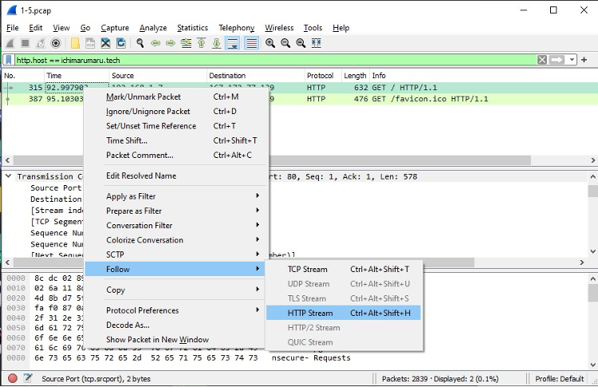
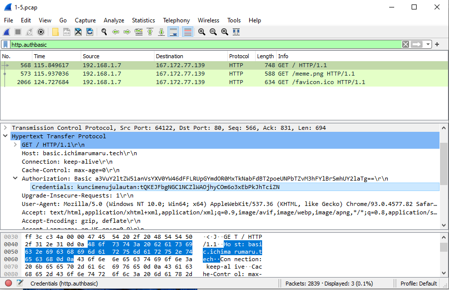
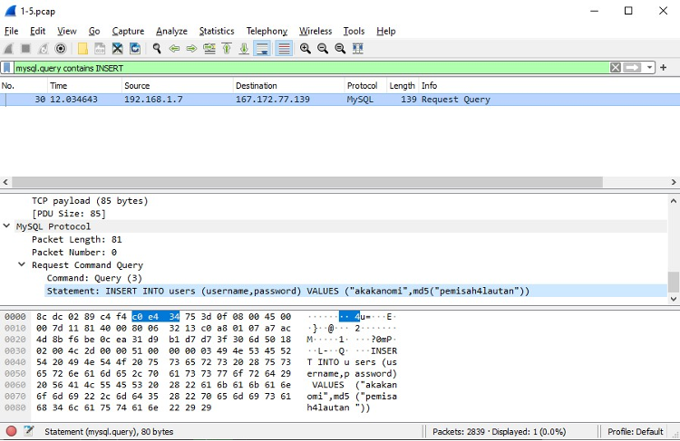
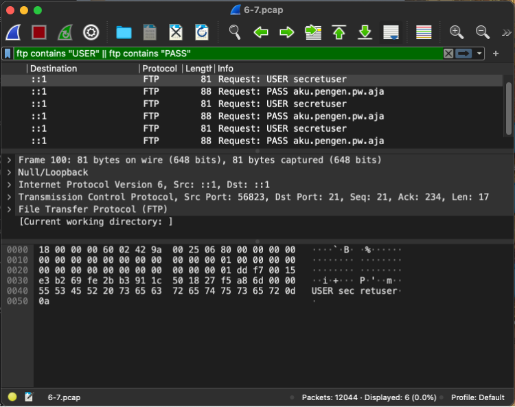
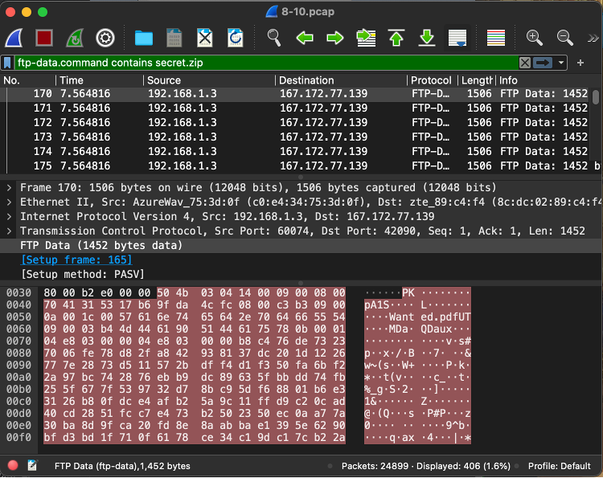
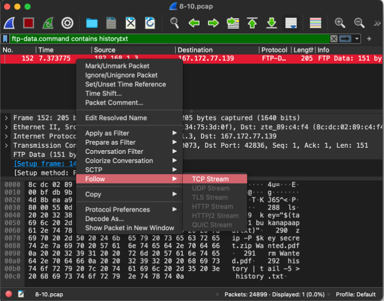

# Soal dan Pembahasan Modul 1

## No 1

### Soal

Sebutkan webserver yang digunakan pada "ichimarumaru.tech"!

- Untuk mencari webservernya, kita bisa menggunakan display filter `http.host == ichimarumaru.tech`
  

- Setelah itu, lakukan follow pada HTTP streamnya
  

- Lalu, muncullah web server dari host yang dicari
  

## No 2

### Soal

Temukan paket dari web-web yang menggunakan basic authentication method!

- Untuk mencari web yang menggunakan basic authentication method, dapat digunakan display filter `http.authbasic`
  

## No 3

### Soal

Ikuti perintah di basic.ichimarumaru.tech! Username dan password bisa didapatkan dari file .pcapng!

- Lakukan display filter menggunakan `http.authbasic` dan cari credetials di dalam bagian authentication, bagian kiri sebelum ':' adalah username dan bagian lainnya adalah password
  

- Setelah dimasukkan ke dalam basic.ichimarumaru.tech, website menampilkan soal mengenai pengkabelan T568A.
  

## No 4

### Soal

Temukan paket mysql yang mengandung perintah query select!

- Untuk mencari paket mysql mengandung query select, dapat digunakan display filter `mysql.query matches select`
  

## No 5

### Soal

Login ke portal.ichimarumaru.tech kemudian ikuti perintahnya! Username dan password bisa didapat dari query insert pada table users dari file .pcap!

- Untuk mencari query insert, dapat menggunakan display filter seperti pada no 4 yaitu `mysql.query matches insert`, setelah itu bisa kita lihat pada bagian statement dari sqlnya terdapat username dan password.
  
  
- Setelah login terdapat soal mengenai pengkabelan T658B
  

## No 6

### Soal

Cari username dan password ketika melakukan login ke FTP Server!

- Menggunakan display filter dengan command **ftp contains “USER” || ftp contains “PASS”** untuk melakukan filter agar hanya USER (username) dan PASS (password) yang muncul.  
  

## No 7

### Soal

Ada 500 file zip yang disimpan ke FTP Server dengan nama 0.zip, 1.zip, 2.zip, ..., 499.zip. Simpan dan Buka file pdf tersebut. (Hint = nama pdf-nya "Real.pdf")

- Menggunakan display filter dengan command **frame contains Real.pdf** untuk melakukan filter agar yang muncul hanya yang mempunyai **Real.pdf**. 
  
- Untuk mendownload filenya kita lakukan **Right Click -> Follow -> TCP Stream**.  
  
- Lalu lakukan **Show Data as Raw** lalu download file tersebut. Isi file sebagai berikut:  
  

## No 8

### Soal

Cari paket yang menunjukan pengambilan file dari FTP tersebut!

- Menggunakan display filter **ftp.request.command == RETR** untuk menunjukkan paket yang menunjukkan pengambilan file dari ftp.  
  

## No 9

### Soal

Dari paket-paket yang menuju FTP terdapat inidkasi penyimpanan beberapa file. Salah satunya adalah sebuah file berisi data rahasia dengan nama "secret.zip". Simpan dan buka file tersebut!

- Menggunakan display filter **ftp-data.command contains secret.zip** untuk mencari file yang mengandung kata **secret.zip**.  
  
- Lalu untuk mendownload filenya dilakukan **Right Click -> Follow -> TCP Stream**.  
  
- Setelah itu lakukan **Show Data as Raw** dan download file tersebut. Saat File zip tersebut sudah didownload dan dibuka, maka akan muncul kolom untuk menambahkan password.  
  
- Password didapatkan dari soal No 10, dan setelah dimasukkan passwordnya akan muncul gambar berikut:  
  

## No 10

### Soal

Selain itu terdapat "history.txt" yang kemungkinan berisi history bash server tersebut! Gunakan isi dari "history.txt" untuk menemukan password untuk membuka file rahasia yang ada di "secret.zip"!

- Menggunakan display filter **ftp-data.command contains history.txt** untuk menyaring file yang hanya mengandung kata **history.txt**.  
  
- Lalu untuk membuka filenya dilakukan **Right Click -> Follow -> TCP Stream**.  
  
- Isi file mengandung command bash yang menyatakan bahwa password berada di dalam file **bukanapaapa.txt**.  
  
- Setelah itu digunakan display filter **ftp-data.command contains bukanapaapa.txt** untuk menyaring file yang hanya mengandung kata **bukanapaapa.txt**.  
  
- Sama seperti tadi, untuk membuka filenya dilakukan **Right Click -> Follow -> TCP Stream**.  
  
- Di dalam file tersebut berisi password yang dibutuhkan untuk soal No 9.  
  

## No 11

### Soal

Filter sehingga wireshark hanya mengambil paket yang berasal dari port 80!

- Menggunakan capture filter dengan command **src port 80** untuk menangkap paket yang berasal dari port 80. Port 80 digunakan untuk mengakses web HTTP.  
- Pada gambar dibawah ini tidak terdapat paket yang ditangkap karena tidak sedang mengakses web HTTP 
  

## No 12

### Soal

Filter sehingga wireshark hanya mengambil paket yang mengandung port 21!

- Menggunakan capture filter dengan command **port 21** untuk menangkap paket yang mengandung port 21. Paket yang mengandung port 21 adalah paket yang berasal dari port 21 dan memiliki tujuan ke port 21. Port 21 digunakan untuk mengakses filezilla server 
- Pada gambar dibawah ini tidak terdapat paket yang ditangkap karena tidak sedang mengakses filezilla server 
  

## No 13

### Soal

Filter sehingga wireshark hanya menampilkan paket yang menuju port 443!

- Menggunakan capture filter dengan command **dst port 443** untuk menangkap paket yang tujuannya ke port 443. 
  

## No 14

### Soal

Filter sehingga wireshark hanya mengambil paket yang tujuannya ke kemenag.go.id!

- Menggunakan capture filter dengan command **dst host kemenag.go.id** untuk menangkap paket yang tujuannya ke kemenag.go.id. Paket-paket tersebut didapatkan ketika mengakses web kemenag.go.id. 
  

## No 15

### Soal

Filter sehingga wireshark hanya mengambil paket yang berasal dari ip kalian!

- Untuk menangkap paket yang berasal dari ip host menggunakan command **src host [ip address]** dengan IP Address yang digunakan ketika praktikum adalah 192.168.43.67  
  
